# Blockchain-Lab2

## 如何运行

补充如何完整运行你的应用。

1. 在本地启动ganache应用。

2. 在 `./contracts` 中安装需要的依赖，运行如下的命令：
    ```bash
    npm install
    ```
3. 在 `./contracts` 中编译合约，运行如下的命令：
    ```bash
    npx hardhat compile
    ```
4. 部署到ganache，运行如下命令： 
   ```bash
   npx hardhat run ./scripts/deploy.ts --network ganache
   ```
   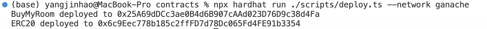
5. 将地址填入`contract-addresses.json`
6. 在 `./frontend` 中安装需要的依赖，运行如下的命令：
    ```bash
    npm install
    ```
7. 在 `./frontend` 中启动前端程序，运行如下的命令：
    ```bash
    npm run start
    ```

## 功能实现分析

1.连接钱包
连接钱包功能通过useEffect钩子和initCheckAccounts异步函数实现。在组件加载时，useEffect钩子会调用initCheckAccounts检查是否存在window.ethereum，以确认用户是否安装了钱包插件MetaMask。如果ethereum对象存在，代码会调用ethereum.request({ method: 'eth_accounts' })来获取用户的账户列表，并将第一个账户设为当前账户并存储在account状态中，方便在界面上显示。

2.免费领取测试房产（只有一次）
该功能通过BuyMyRoom.sol中的getfreeHouses函数实现。合约检查调用者是未领取过房屋。满足条件时，调用者可领取三栋房屋NFT，合约会记录领取状态，确保每个用户仅能领取一次。前端中通过“领取测试房产”按钮实现。

3.出售房屋
出售功能在BuyMyRoom.sol的listHouse函数中实现。合约通过前端传来的tokenId和price设置对应房屋的状态。前端在输入框中输入房子ID以及出售价格并点击“挂单出售”按钮实现。

4.ETH兑换ERC20代币
兑换功能在ERC20.sol合约中mint函数以及BuyMyRoom.sol中的buyTokens函数实现。用户调用buyTokens并发送一定数量的以太币。buyTokens函数验证接收的以太币数量，计算对应的代币数量并调用mint。ERC20合约在mint函数中调用_mint方法，将等量ERC20代币分配给用户。

5.用户查看自己拥有的房产列表
该功能通过BuyMyRoom.sol中的getOwnInfo函数实现。调用时合约会返回调用者所拥有的房屋NFT的House结构体列表，使用户能在前端界面查看其所有房产的各种信息。

6.用户查看所有出售中的房产，并查询一栋房产的主人及各种挂单信息
此功能在BuyMyRoom.sol中通过getSaleHouse函数实现。调用时合约会返回所有isForSale状态为true的房屋NFT的House结构体列表，使用户能在前端界面查看所有出售房产的信息。

7.用户用ERC20代币购买房屋
购买功能由BuyMyRoom.sol中的buyHouse函数实现。用户调用该函数并支付房屋的ERC20代币价格，合约验证代币余额并完成房屋NFT转移。手续费按照挂单时长从支付金额中扣除，平台账户获得相应手续费。

## 项目运行截图
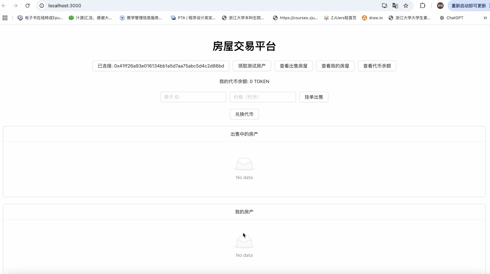
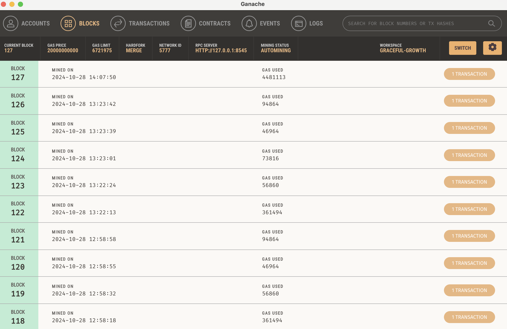
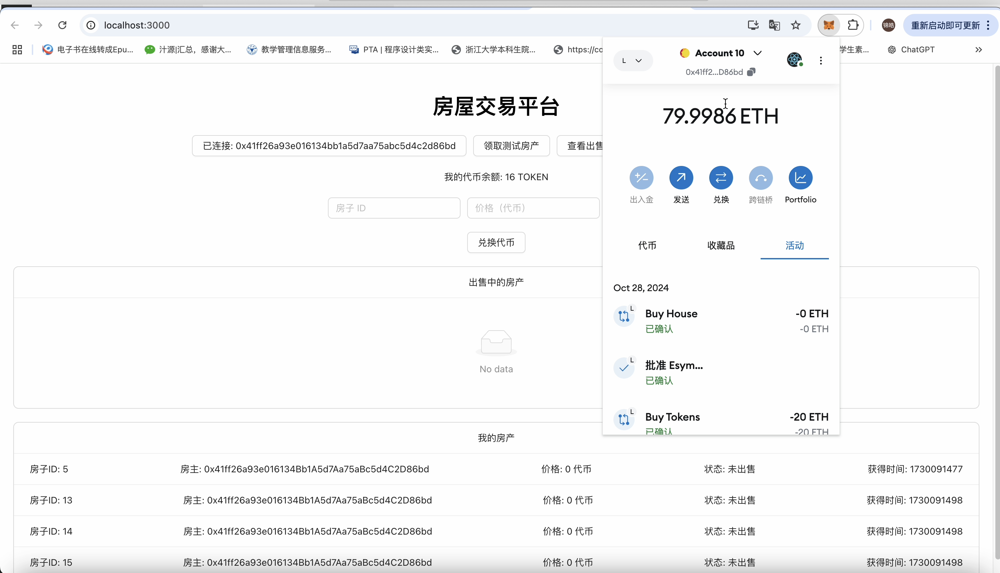
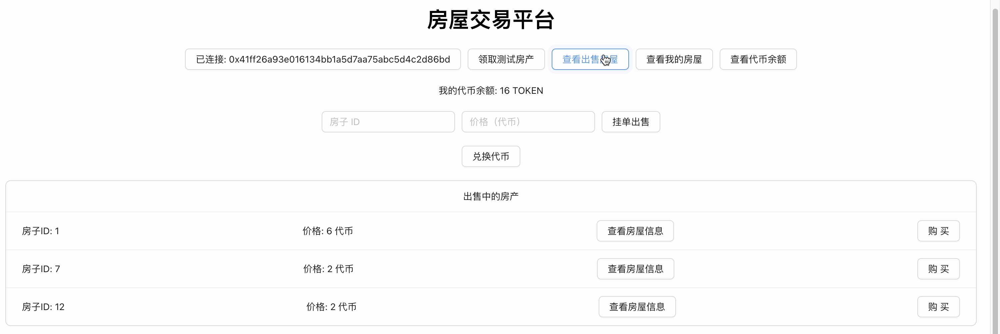
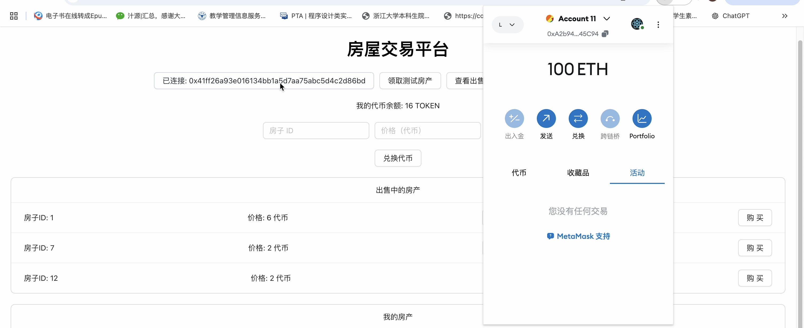
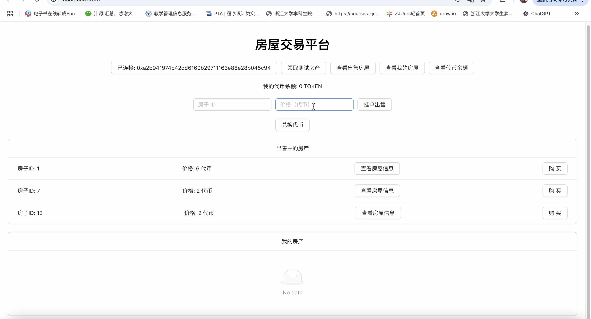
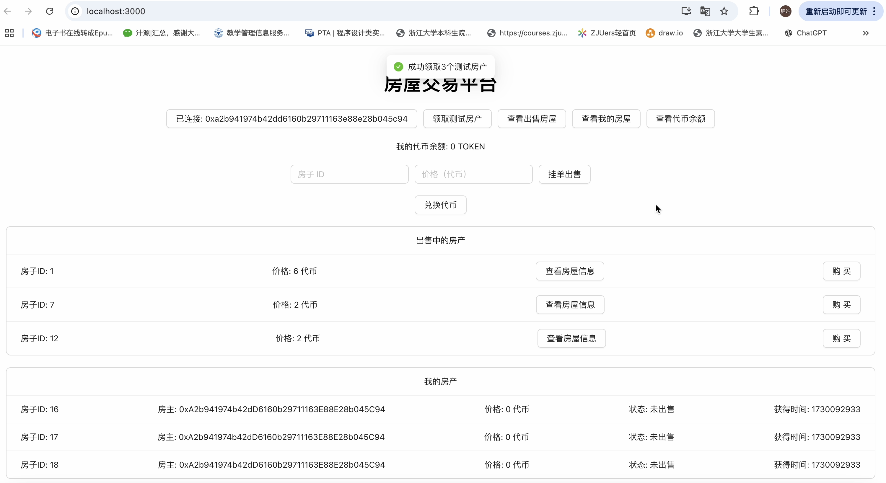
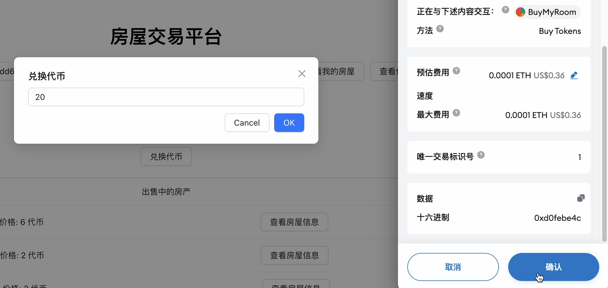
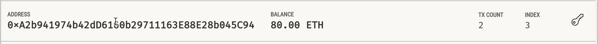
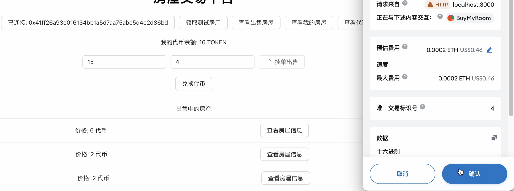
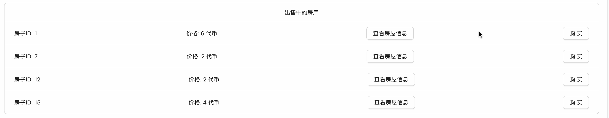
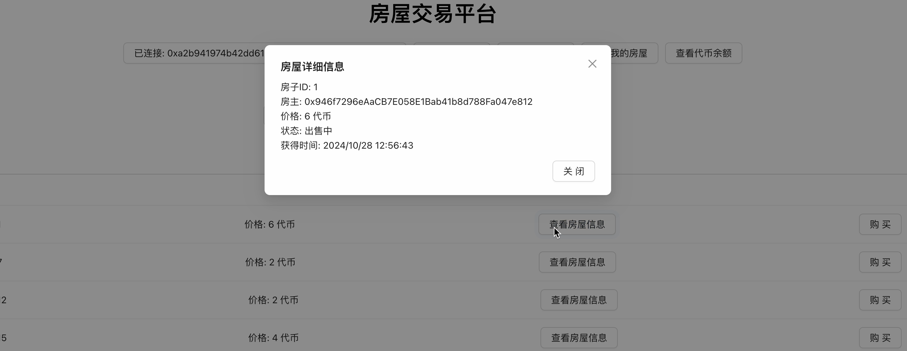
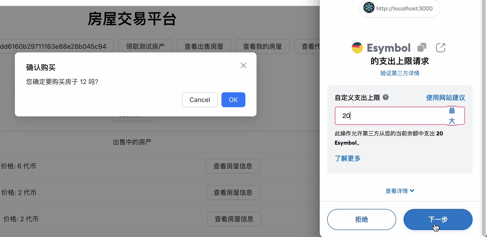
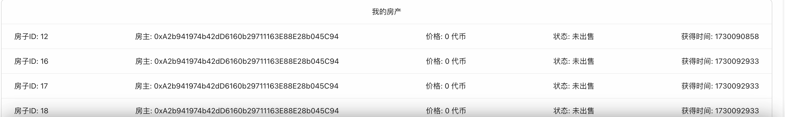

具体见演示视频。